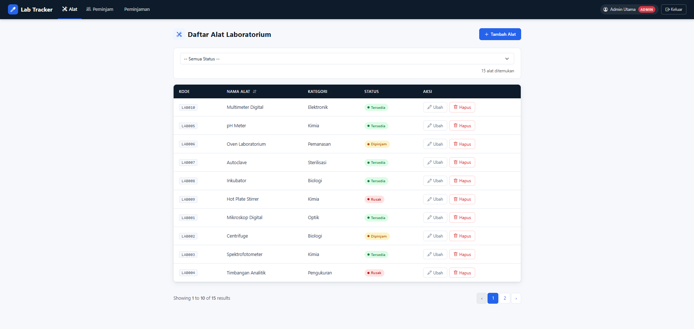
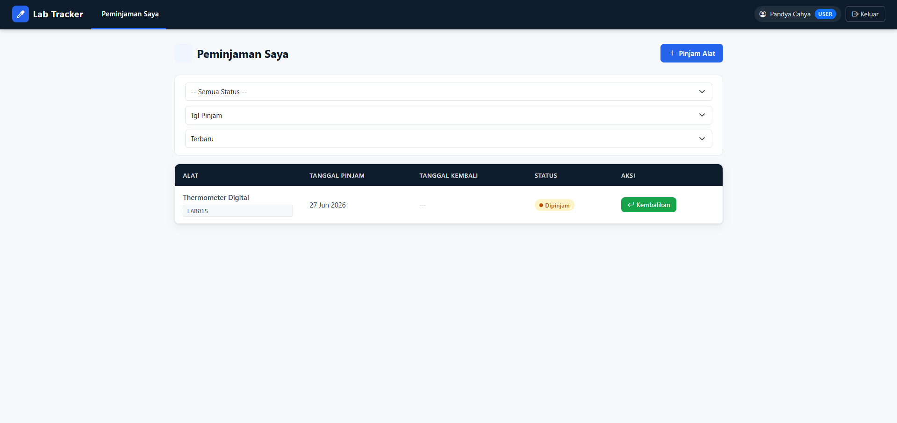

# Lab Tracker — Pelacak Peminjaman Alat Laboratorium

**Posisi yang dilamar: Frontend**

---

## Tentang Aplikasi

Aplikasi ini saya buat sebagai take-home test dengan tema pelacak peminjaman alat laboratorium. Idenya sederhana, selama ini pencatatan peminjaman alat lab sering dilakukan manual, jadi saya coba buat versi digitalnya.

Ada dua jenis pengguna di aplikasi ini:

- **Admin** — bisa mengelola data alat, data peminjam, dan melihat seluruh riwayat peminjaman
- **User / Peminjam** — bisa mengajukan peminjaman alat dan mencatat pengembaliannya sendiri

Yang bisa dilakukan di aplikasi ini:
- Tambah, lihat, edit, dan hapus data **Alat**
- Tambah, lihat, edit, dan hapus data **Peminjam**
- Catat peminjaman dan pengembalian alat beserta statusnya
- Filter dan urutkan data di setiap halaman
- Cari peminjam berdasarkan nama
- Daftar akun baru — data peminjam otomatis terbuat dari data registrasi
- Endpoint JSON di `/api/alat` untuk mengambil data alat tanpa login

---

## Teknologi yang Digunakan

| Komponen | Versi |
|---|---|
| PHP | ^8.2 |
| Laravel | ^12.x |
| Bootstrap | 5.3.3 |
| Bootstrap Icons | 1.11.3 |
| Database | MySQL |

---

## Cara Menjalankan Aplikasi

### 1. Clone repository ini

```bash
git clone https://github.com/Pann99/LabTracker.git
cd lab-tracker
```

### 2. Install dependency

```bash
composer install
```

### 3. Salin file .env

```bash
cp .env.example .env
```

### 4. Generate app key

```bash
php artisan key:generate
```

### 5. Isi konfigurasi database di file `.env`

```env
DB_CONNECTION=mysql
DB_HOST=127.0.0.1
DB_PORT=3306
DB_DATABASE=lab_tracker
DB_USERNAME=root
DB_PASSWORD=
```

Pastikan database `lab_tracker` sudah dibuat terlebih dahulu di MySQL.

### 6. Jalankan migration

```bash
php artisan migrate
```

### 7. Jalankan seeder untuk akun default

```bash
php artisan db:seed
```

### 8. Jalankan server

```bash
php artisan serve
```

---

## Akses Aplikasi

Buka browser dan akses `http://localhost:8000`

Akun yang sudah tersedia setelah seeder dijalankan:

| Role | Email | Password |
|---|---|---|
| Admin | admin@gmail.com | admin123 |
| User | user@gmail.com | user123 |

Untuk user bisa juga daftar akun baru lewat halaman registrasi dan nantinya akun otomatis masuk sebagai User/Peminjam.

---

## Endpoint JSON

```
GET http://localhost:8000/api/alat
```

Mengembalikan seluruh data alat dalam format JSON, bisa diakses tanpa login.

---

## Tangkapan Layar

### Halaman Daftar Alat (Admin)


### Halaman Peminjaman Saya (User)


---

## Struktur Tabel

| Tabel | Kolom Utama |
|---|---|
| `users` | id, name, email, password, role |
| `alats` | id, kode_alat, nama_alat, kategori, status |
| `peminjams` | id, nama, nim_nip, kontak |
| `peminjaman` | id, alat_id, peminjam_id, tanggal_pinjam, tanggal_kembali, status |

Tabel `peminjaman` berelasi ke `alats` dan `peminjams` lewat foreign key.